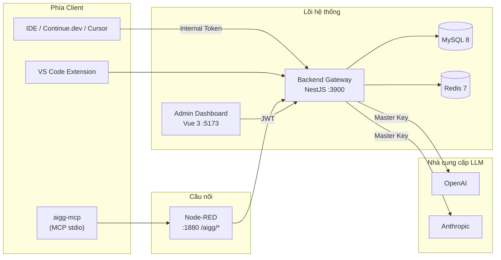

<div align="center">

# 🛡️ AI Governance Gateway & ROI Dashboard

**Cổng quản trị tài nguyên AI cho doanh nghiệp** — đếm token, quản lý hạn ngạch, đo lường ROI nhân sự, đánh giá chất lượng prompt và tích hợp hệ thống quản lý công việc (Jira / GitLab / GitHub).


</div>

---

## 📑 Mục lục

1. [Giới thiệu](#1-giới-thiệu)
2. [Tính năng chính](#2-tính-năng-chính)
3. [Kiến trúc hệ thống](#3-kiến-trúc-hệ-thống)
4. [Công nghệ sử dụng](#4-công-nghệ-sử-dụng)
5. [Yêu cầu cài đặt](#5-yêu-cầu-cài-đặt)
6. [Hướng dẫn triển khai từng bước](#6-hướng-dẫn-triển-khai-từng-bước-cho-cả-người-không-rành-kỹ-thuật) (cho cả người không rành kỹ thuật)
7. [Bảng cổng & dịch vụ](#7-bảng-cổng--dịch-vụ)
8. [Biến môi trường](#8-biến-môi-trường)
9. [Tích hợp IDE & MCP](#9-tích-hợp-ide--mcp)
10. [Danh mục API](#10-danh-mục-api)
11. [Cấu trúc thư mục](#11-cấu-trúc-thư-mục)
12. [Khắc phục sự cố](#12-khắc-phục-sự-cố)
13. [Bảo mật](#13-bảo-mật)

---

## 1. Giới thiệu

**AI Governance Gateway (AIGG)** là một **reverse proxy trung gian** đứng giữa các công cụ AI phía client (Continue.dev, Cursor, VS Code, MCP) và các nhà cung cấp LLM (OpenAI, Anthropic). Hệ thống giúp doanh nghiệp:

- 🔐 **Xác thực nội bộ** — cấp Internal Token (`storo_live_...`) cho từng nhân sự, không bao giờ lộ Master API Key của công ty.
- 📊 **Quản trị hạn ngạch** — giới hạn token theo Ngày / Tuần / Tháng / Task, hỗ trợ gói Addon cộng dồn (roll-over).
- 💰 **Đo lường ROI** — quy đổi token tiêu thụ ra chi phí thực, đối chiếu giờ hành chính/tăng ca (OT multiplier) để tính giá trị giờ công tiết kiệm (Net ROI).
- ✨ **Quản lý Prompt** — tự động capture ngữ cảnh đầu vào (chỉ lưu **bản rút gọn + hash**, không lưu nội dung gốc), chấm điểm chất lượng và đề xuất cache prompt tốt.
- 🔗 **Tích hợp 3rd-party** — đồng bộ task từ Jira/GitLab/GitHub, nhận webhook, và cung cấp API outbound cho hệ thống PM đọc ngược usage/ROI theo từng ticket.

> 💡 Toàn bộ schema và dữ liệu khởi tạo (quyền, vai trò, menu, tài khoản admin) được **seed tự động** lần đầu chạy — không cần thao tác SQL thủ công.

---

## 2. Tính năng chính

| Nhóm | Tính năng |
| :-- | :-- |
| **Gateway** | Proxy streaming (SSE) sang OpenAI/Anthropic; kiểm tra quota trước mỗi request; ghi audit log bất đồng bộ |
| **Hạn ngạch** | Quota DAILY/WEEKLY/MONTHLY/TASK; Addon cộng dồn; cảnh báo vượt ngưỡng |
| **ROI Dashboard** | KPI chi phí AI, giờ công tiết kiệm, Net ROI; biểu đồ xu hướng; phát hiện bất thường (anomaly) |
| **Prompt Management** | Capture prompt (preview + SHA-256 hash); chấm điểm chất lượng tự động; danh sách prompt; cache prompt chất lượng |
| **RBAC** | Module → Scope → Permission; vai trò; menu động lọc theo quyền; tài khoản admin toàn quyền |
| **Tích hợp** | Kết nối Jira/GitLab/GitHub (token mã hóa AES-256-GCM); pull/webhook; outbound API cho hệ thống PM |
| **MCP Bridge** | Cầu nối MCP (stdio) → Node-RED → Gateway: AI agent tự báo cáo usage, xem task, xem quota |
| **VS Code Extension** | Tiện ích gắn Task ID theo branch, báo cáo usage ngay trong IDE |

---

## 3. Kiến trúc hệ thống



**5 ứng dụng trong monorepo:**

| App | Vai trò | Port |
| :-- | :-- | :-- |
| `apps/backend-gateway` | Lõi: Gateway, Quota, Audit, Reports, RBAC, Prompt, Integrations | 3900 |
| `apps/admin-dashboard` | Giao diện quản trị (Vue 3) | 5173 (dev) |
| `apps/node-red` | Cầu nối MCP ↔ Gateway (Node-RED nhúng) | 1880 |
| `apps/aigg-mcp` | MCP server (stdio) cho AI agent | — (stdio) |
| `apps/vscode-extension` | Tiện ích VS Code báo cáo usage | — (VSIX) |

---

## 4. Công nghệ sử dụng

- **Backend:** Node.js, NestJS 10, Sequelize (sequelize-typescript), MySQL 8, Redis (ioredis), Axios, JWT. TypeScript strict (không dùng `any`), kiến trúc Controller → Service → Entity → DTO.
- **Frontend:** Vue 3 (Composition API, `<script setup>`), Vite, Tailwind CSS, Pinia, Chart.js + vue-chartjs, driver.js.
- **Bridge/Tooling:** Node-RED nhúng (Express), Model Context Protocol SDK, VS Code Extension API.

---

## 5. Yêu cầu cài đặt

Cần cài 2 phần mềm trên máy trước:

| Phần mềm | Phiên bản | Tải về |
| :-- | :-- | :-- |
| **Node.js** | ≥ 20 | <https://nodejs.org> (chọn bản LTS) |
| **Docker Desktop** | mới nhất | <https://www.docker.com/products/docker-desktop> |

> Docker dùng để chạy MySQL + Redis tự động. Nếu bạn đã có sẵn MySQL 8 và Redis 7 thì có thể bỏ qua Docker và điền thông tin kết nối vào `.env`.

Kiểm tra đã cài đúng chưa:
```bash
node -v     # phải in ra v20.x trở lên
docker -v   # phải in ra phiên bản Docker
```

---

## 6. Hướng dẫn triển khai từng bước (cho cả người không rành kỹ thuật)

> Làm tuần tự từ trên xuống. Mỗi lệnh copy nguyên dòng, dán vào **Terminal** (macOS/Linux) hoặc **PowerShell** (Windows) rồi Enter.

### Bước 1 — Tải mã nguồn về
```bash
git clone https://github.com/techablevn/ai-governance-gateway.git
cd ai-governance-gateway
```

### Bước 2 — Tạo file cấu hình `.env`
```bash
cp .env.example .env
```
Mở file `.env` bằng trình soạn thảo bất kỳ và **sửa tối thiểu các dòng sau**:
```env
OPENAI_API_KEY=sk-...            # Master Key OpenAI thật của công ty
ANTHROPIC_API_KEY=sk-ant-...     # Master Key Anthropic thật
MYSQL_PASSWORD=mật-khẩu-mysql-của-bạn
JWT_SECRET=chuỗi-ngẫu-nhiên-dài-bất-kỳ
ADMIN_EMAIL=admin@congty.com     # email đăng nhập dashboard
ADMIN_PASSWORD=mật-khẩu-admin-mạnh
```
> Các dòng còn lại có thể để mặc định khi chạy thử trên máy cá nhân.

### Bước 3 — Khởi động cơ sở dữ liệu (MySQL + Redis)
```bash
docker compose up -d mysql redis
```
Lệnh này tự tải và chạy MySQL + Redis trong nền. Đợi ~30 giây cho database sẵn sàng.

### Bước 4 — Chạy Backend Gateway
```bash
cd apps/backend-gateway
npm install
npm run start:dev
```
Lần đầu chạy, hệ thống **tự tạo toàn bộ bảng và nạp dữ liệu mẫu** (vai trò, quyền, menu, tài khoản admin). Khi thấy log `Nest application successfully started` là OK. Backend chạy tại **http://localhost:3900**.

> Để nguyên cửa sổ Terminal này đang chạy, **mở một cửa sổ Terminal mới** cho bước tiếp theo.

### Bước 5 — Chạy Admin Dashboard
```bash
cd ai-governance-gateway/apps/admin-dashboard
cp .env.example .env
npm install
npm run dev
```
Mở trình duyệt vào địa chỉ Terminal in ra (mặc định **http://localhost:5173**).

### Bước 6 — Đăng nhập
Dùng đúng `ADMIN_EMAIL` / `ADMIN_PASSWORD` bạn đã đặt trong `.env` ở Bước 2.

✅ **Xong!** Bạn đã có một hệ thống AIGG hoạt động đầy đủ trên máy.

<details>
<summary><b>(Tùy chọn) Bước 7 — Chạy cầu nối MCP qua Node-RED</b></summary>

```bash
cd ai-governance-gateway/apps/node-red
npm install
npm start
```
- Trình quản lý luồng (editor): **http://localhost:1880/mdw** — đăng nhập bằng chính tài khoản admin của Gateway.
- Lần đầu chạy sẽ tự nạp flow mẫu từ `apps/aigg-mcp/node-red-flow.sample.json` (các tool: `aigg_active_task`, `aigg_my_tasks`, `aigg_assign_to_ai`, `aigg_report_usage`, `aigg_quota`…).
</details>

---

## 7. Bảng cổng & dịch vụ

| Dịch vụ | URL | Ghi chú |
| :-- | :-- | :-- |
| Backend Gateway | http://localhost:3900 | API + health `/health` |
| Admin Dashboard | http://localhost:5173 | Vite dev server |
| Node-RED editor | http://localhost:1880/mdw | Quản lý flow MCP |
| Node-RED webhooks | http://localhost:1880/aigg/* | `/manifest`, `/invoke` |
| MySQL | localhost:3306 | Docker container |
| Redis | localhost:6379 | Docker container |

---

## 8. Biến môi trường

Tất cả khai báo trong `.env` (gốc). Xem mẫu đầy đủ tại [`.env.example`](.env.example).

| Biến | Ý nghĩa | Mặc định |
| :-- | :-- | :-- |
| `APP_SECRET` / `CREDENTIAL_SECRET` | Khóa mã hóa nội bộ (AES-256-GCM) | — |
| `MYSQL_*` | Kết nối MySQL | localhost:3306 |
| `REDIS_*` | Kết nối Redis | localhost:6379 |
| `BACKEND_PORT` | Cổng backend | 3900 |
| `DB_SYNC` | Tự tạo/đồng bộ schema | true |
| `DB_SEED` | Nạp dữ liệu seed lần đầu | true |
| `OPENAI_API_KEY` / `ANTHROPIC_API_KEY` | Master Key trả tiền — **không lộ ra client** | — |
| `JWT_SECRET` / `JWT_EXPIRES_IN` | Ký & hạn JWT đăng nhập dashboard | / 12h |
| `USD_TO_VND_FALLBACK` | Tỷ giá dự phòng cho ROI | 25400 |
| `INTEGRATION_API_KEY` | Khóa cho hệ thống PM gọi outbound API | — |
| `ADMIN_EMAIL` / `ADMIN_PASSWORD` | Tài khoản admin seed lần đầu | — |
| `VITE_API_BASE_URL` | URL backend cho dashboard | http://localhost:3900 |
| `NODE_RED_*`, `AIGG_GATEWAY_URL`, `AIGG_BRANCH_REGEX` | Cấu hình cầu Node-RED/MCP | :1880, /mdw |

> ⚠️ Production: sau khi DB ổn định nên đặt `DB_SYNC=false` và `DB_SEED=false` để tránh thay đổi schema ngoài ý muốn.

---

## 9. Tích hợp IDE & MCP

### Continue.dev / Cursor
1. Đăng nhập Dashboard → làm theo tour 4 bước (driver.js) để lấy **Internal Token** cá nhân.
2. Copy khối trong [`ide-configs/continue-config.json`](ide-configs/continue-config.json) vào `~/.continue/config.json`, thay `apiKey` bằng Internal Token và đặt header `X-Task-ID` khớp mã thẻ công việc.
3. (Tùy chọn) chạy `bash ide-configs/install-hook.sh` để tự bóc tách Task ID từ tên branch git.

### MCP (cho AI agent)
`apps/aigg-mcp` là MCP server (stdio) chuyển tiếp qua Node-RED. Cấu hình bằng biến môi trường: `AIGG_NODE_RED_URL`, `AIGG_TOKEN` (JWT), `AIGG_PROJECT_ID`, `AIGG_TASK_ID`. Xem chi tiết tại [`apps/aigg-mcp/README.md`](apps/aigg-mcp/README.md).

### VS Code Extension
```bash
cd apps/vscode-extension
npm install
npm run install:code     # đóng gói VSIX và cài vào VS Code
```

---

## 10. Danh mục API

### Gateway (Internal Token: header `Authorization: Bearer storo_live_...` + `X-Task-ID`)
| Method | Endpoint | Mô tả |
| :-- | :-- | :-- |
| POST | `/v1/chat/completions` | Proxy streaming (SSE) sang OpenAI/Anthropic; check quota, ghi audit log async |
| POST | `/v1/usage/ingest` | Nạp usage ước lượng (đếm token, tính cost), capture prompt nếu có `promptText` |

### Quản trị (JWT — đăng nhập Dashboard)
| Method | Endpoint | Mô tả |
| :-- | :-- | :-- |
| POST | `/v1/auth/login` | Đăng nhập, trả JWT |
| GET | `/v1/auth/me` | Hồ sơ + vai trò + danh sách permission |
| GET | `/v1/admin/menus/my` | Cây menu đã lọc theo quyền |
| GET | `/v1/reports/summary` | KPI: chi phí AI, labor saved, Net ROI |
| GET | `/v1/reports/trends?granularity=DAILY\|WEEKLY\|MONTHLY` | Xu hướng token & chi phí |
| GET | `/v1/reports/anomalies` | Danh sách task bị gắn cờ bất thường |
| GET | `/v1/prompts` · `/v1/prompts/performance` · `/v1/prompts/cached` | Prompt Management |
| PUT | `/v1/prompts/:id/cache` · `/v1/prompts/:id/knowledge` | Cache / đưa prompt vào knowledge |
| CRUD | `/v1/projects`, `/v1/work/tasks` | Dự án & công việc |
| CRUD | `/v1/admin/roles`, `/v1/admin/users`, `/v1/admin/menus` | RBAC (theo permission) |
| GET/PUT | `/v1/quotas`, `/v1/settings` | Hạn ngạch & cấu hình |

### Tích hợp 3rd-party
| Method | Endpoint | Auth | Mô tả |
| :-- | :-- | :-- | :-- |
| CRUD | `/v1/integrations/connections` | JWT | Kết nối Jira/GitLab/GitHub (token mã hóa) |
| POST | `/v1/integrations/connections/:id/sync` | JWT | Pull issue/task về `ai_tasks` |
| POST | `/v1/integrations/webhooks/:id` | HMAC | Nhận webhook, upsert task |
| GET | `/v1/integrations/external/tasks/:taskId/usage` | `X-AIGG-Api-Key` | Outbound: PM đọc usage/ROI |

Ví dụ outbound:
```bash
curl http://localhost:3900/v1/integrations/external/tasks/TERO-102/usage \
  -H "X-AIGG-Api-Key: <INTEGRATION_API_KEY>"
```

---

## 11. Cấu trúc thư mục

```text
ai-governance-gateway/
├── apps/
│   ├── backend-gateway/    # NestJS — Gateway, Quota, Audit, Reports, RBAC, Prompt, Integrations
│   ├── admin-dashboard/    # Vue 3 + Vite + Tailwind + Pinia
│   ├── node-red/           # Cầu nối MCP ↔ Gateway (Node-RED nhúng)
│   ├── aigg-mcp/           # MCP server (stdio) + flow mẫu
│   └── vscode-extension/   # Tiện ích VS Code
├── ide-configs/            # continue-config.json + install-hook.sh + report-usage.mjs
├── docker-compose.yml      # MySQL 8 + Redis 7 + backend
├── .env.example            # Mẫu biến môi trường
└── README.md
```

---

## 12. Khắc phục sự cố

| Triệu chứng | Nguyên nhân & cách xử lý |
| :-- | :-- |
| Backend báo lỗi kết nối DB | MySQL chưa sẵn sàng — đợi thêm hoặc kiểm tra `docker compose ps`; xác nhận `MYSQL_*` trong `.env` đúng |
| Đăng nhập dashboard thất bại | Sai `ADMIN_EMAIL`/`ADMIN_PASSWORD`; tài khoản chỉ seed **lần đầu** khi DB trống |
| Cổng bị chiếm (EADDRINUSE) | Đổi `BACKEND_PORT` / port Vite, hoặc tắt tiến trình đang dùng cổng |
| Gọi `/v1/usage/ingest` trả `persisted=false` | `taskId` phải là **ai_task UUID** (lấy qua `assign-ai`/MCP `aigg_assign_to_ai`), không phải id công việc |
| Schema không cập nhật | Đảm bảo `DB_SYNC=true` ở môi trường dev |

---

## 13. Bảo mật

- 🔑 **Master API Key** chỉ nằm ở backend, không bao giờ gửi xuống client.
- 🧾 **Audit log không lưu nội dung code** (`request_body`/`response_payload`) — chỉ metadata tài chính, thời gian, token.
- ✂️ **Prompt Management** chỉ lưu **bản rút gọn + SHA-256 hash**, không lưu prompt gốc.
- 🔐 Token tích hợp 3rd-party được **mã hóa AES-256-GCM** trước khi lưu DB.
- 🚫 File `.env` (chứa secret thật) đã được `.gitignore` loại trừ — chỉ commit `.env.example`.

---

<div align="center">
<sub>© Techable — AI Governance Gateway. Internal / Proprietary.</sub>
</div>
