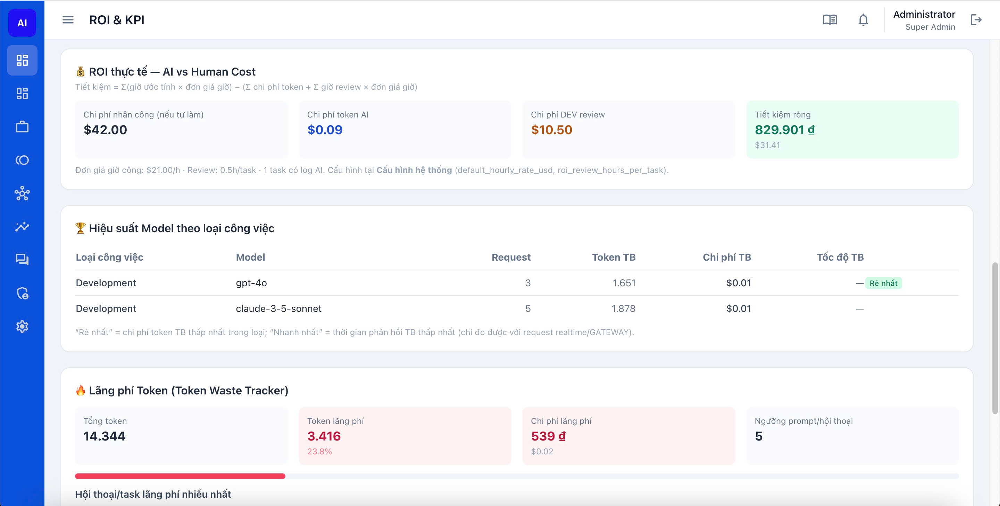
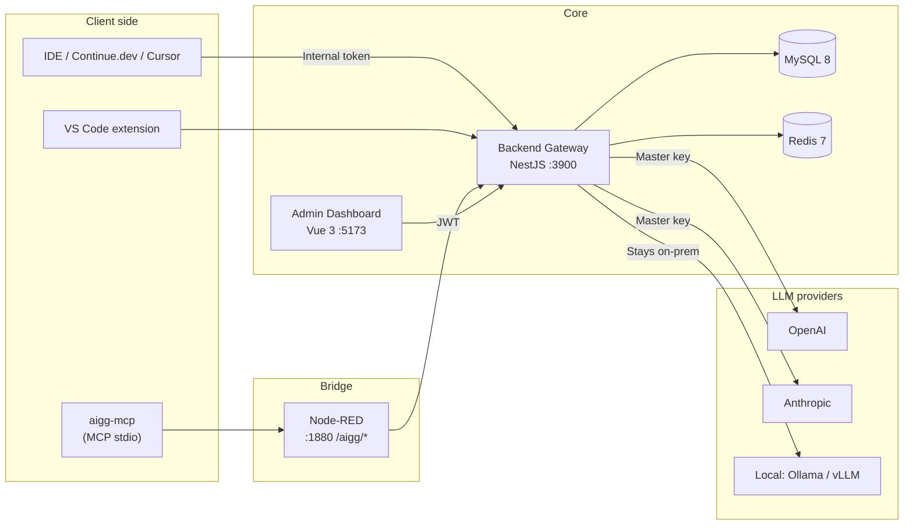

<div align="center">

# 🛡️ AI Governance Gateway & ROI Dashboard

**Self-hosted, privacy-first governance gateway for AI coding teams** — meter every token, enforce quotas, run on your own local LLMs, and prove the real ROI of AI on engineering work.


[](LICENSE)

**English · 🌐 [Tiếng Việt](README.vi.md)**

[Live overview →](https://techrun.ai.vn/ai-governance-gateway)



</div>

---

## 🤖 Built with Claude Code — full transparency

**Human architecture, AI execution.**

Let's be upfront before you read the source: **100% of this codebase was generated by [Claude Code](https://claude.com/claude-code).**

I'm a product creator and system architect — I don't specialize in writing code line by line. I spent my cognitive energy where it matters most: defining the business logic, designing the database schema, optimizing the git and orchestration workflows, and structuring how humans and machines collaborate.

Why does this matter? This repository is living proof of the very philosophy it governs. In the AI era, engineers shouldn't be mechanics staring at syntax — we are the **architects**. AI is the ultimate coding machine, but it still needs a human mind for structural design, strategic intent, and governance.

If you're a Tech Lead, CTO, or Project Manager trying to control AI cost while keeping development velocity, this tool was built *by leveraging* AI — specifically to *govern* the future of AI development.

---

## Why AIGG?

AI coding assistants are now a real line item — and a real risk. Most teams can't answer three questions:

1. **Where is the money going?** Which dev, which project, which task burned the tokens?
2. **Is our source code leaving the building?** Cloud LLM APIs see every prompt.
3. **Is any of this actually paying off?** What's the ROI versus engineer hours saved?

**AIGG sits between your IDEs and any LLM** (OpenAI, Anthropic, **or your own local Ollama/vLLM**) and answers all three — without changing how developers work.

- 🏠 **Run fully local.** Route `ollama/…`, `vllm/…`, `local/…` models to your own infra. Prompts and source code **never leave your network**, API cost is **$0**, yet every request still flows through full quota + audit + ROI accounting.
- 🔐 **Never leak the master key.** Each developer gets an internal token (`storo_live_…`); the company's real API keys stay server-side only.
- 📊 **Per-day/week/month/task quotas** with roll-over add-ons and overspend alerts.
- 💰 **ROI dashboard** — converts tokens → real cost, weighs it against baseline vs actual engineer hours (with overtime multiplier) to show **Net ROI**.
- 🪄 **Zero-config attribution.** A git hook reads your branch name (`feature/AIGG-123-…`) and tags every AI request to the right task automatically.
- ✨ **Prompt quality governance.** Captures input context as **preview + SHA-256 hash only** (never the raw prompt), auto-scores quality, and lets you cache the good ones.

> 💡 First boot auto-seeds the full schema + RBAC (roles, permissions, menus, admin user). No manual SQL.

---

## Features

| Area | What it does |
| :-- | :-- |
| **Gateway** | Streaming (SSE) proxy to OpenAI/Anthropic; quota check before every request; async audit logging |
| **Local LLM** | Ollama / vLLM / any OpenAI-compatible endpoint via `ollama/`·`vllm/`·`local/` prefixes — $0 cost, full governance |
| **Quotas** | DAILY/WEEKLY/MONTHLY/TASK limits; roll-over add-ons; overspend alerts |
| **ROI dashboard** | KPIs for AI cost, hours saved, Net ROI; trend charts; anomaly detection |
| **Prompt management** | Capture (preview + SHA-256 hash); automatic quality scoring; prompt list; cache the best |
| **RBAC** | Module → Scope → Permission; roles; permission-filtered dynamic menus; full-access admin |
| **Integrations** | Jira/GitLab/GitHub (AES-256-GCM encrypted tokens); pull/webhook; outbound API for PM tools |
| **MCP bridge** | MCP (stdio) → Node-RED → Gateway: AI agents self-report usage, list tasks, check quota |
| **VS Code extension** | Branch-based Task ID tagging and usage reporting from inside the IDE |

---

## Architecture



**Monorepo apps:**

| App | Role | Port |
| :-- | :-- | :-- |
| `apps/backend-gateway` | Core: Gateway, Quota, Audit, Reports, RBAC, Prompt, Integrations | 3900 |
| `apps/admin-dashboard` | Admin UI (Vue 3) | 5173 (dev) |
| `apps/node-red` | MCP ↔ Gateway bridge (embedded Node-RED) | 1880 |
| `apps/aigg-mcp` | MCP server (stdio) for AI agents | — (stdio) |
| `apps/vscode-extension` | VS Code usage reporter | — (VSIX) |

---

## Tech stack

- **Backend:** Node.js, NestJS 10, Sequelize (sequelize-typescript), MySQL 8, Redis (ioredis), JWT. Strict TypeScript (no `any`), Controller → Service → Entity → DTO.
- **Frontend:** Vue 3 (Composition API, `<script setup>`), Vite, Tailwind CSS, Pinia, Chart.js, driver.js.
- **Bridge/tooling:** embedded Node-RED (Express), Model Context Protocol SDK, VS Code Extension API.

---

## Quick start

**Prerequisites:** [Node.js ≥ 20](https://nodejs.org) and [Docker](https://www.docker.com/products/docker-desktop) (for MySQL + Redis).

```bash
# 1. Clone
git clone https://github.com/techablevn/ai-governance-gateway.git
cd ai-governance-gateway

# 2. Configure environment
cp .env.example .env
#   edit .env → set OPENAI_API_KEY / ANTHROPIC_API_KEY (or just use local LLMs),
#   MYSQL_PASSWORD, JWT_SECRET, ADMIN_EMAIL, ADMIN_PASSWORD

# 3. Start infra (MySQL + Redis)
docker compose up -d mysql redis

# 4. Backend gateway → http://localhost:3900
cd apps/backend-gateway && npm install && npm run start:dev

# 5. Admin dashboard → http://localhost:5173  (new terminal)
cd apps/admin-dashboard && cp .env.example .env && npm install && npm run dev
```

Log in with the `ADMIN_EMAIL` / `ADMIN_PASSWORD` you set. First boot creates all tables and seeds RBAC automatically.

> Optional MCP bridge: `cd apps/node-red && npm install && npm start` → editor at <http://localhost:1880/mdw>.

---

## 🏠 Using local LLMs (Ollama / vLLM)

Point the gateway at your local engine and prefix the model name — that's it:

```env
# .env
LOCAL_LLM_BASE_URL=http://localhost:11434/v1   # Ollama (vLLM: http://localhost:8000/v1)
LOCAL_LLM_API_KEY=                             # Ollama: empty | vLLM: any bearer token
```

Then call any model with a routing prefix:

| Model name sent | Routed to | API cost |
| :-- | :-- | :-- |
| `ollama/llama3.1` | Local Ollama | **$0** |
| `vllm/mistral` | Local vLLM | **$0** |
| `claude-3-5-sonnet` | Anthropic cloud | metered |
| `gpt-4o` | OpenAI cloud | metered |

Local calls are billed at **$0** but still counted for tokens, quota, audit and ROI — so you get governance without sending a single byte of source code to a cloud API.

---

## 🪄 Zero-config task attribution (git hook)

```bash
bash ide-configs/install-hook.sh
```

Installs a `post-checkout` hook. When a developer runs `git checkout -b feature/AIGG-123-add-login`, the Task ID `AIGG-123` is extracted automatically and written to `~/.continue/.task-id` and `.git/aigg-task-id`. Every subsequent AI request from that IDE is attributed to the right task — no manual `X-Task-ID` editing. (Matches Jira/Linear-style keys: `AIGG-WPZ0XZ`, `TERO-102`, `AIGG-123`.)

---

## Ports & services

| Service | URL | Notes |
| :-- | :-- | :-- |
| Backend Gateway | http://localhost:3900 | API + `/health` |
| Admin Dashboard | http://localhost:5173 | Vite dev server |
| Node-RED editor | http://localhost:1880/mdw | MCP flow management |
| Node-RED webhooks | http://localhost:1880/aigg/* | `/manifest`, `/invoke` |
| MySQL / Redis | localhost:3306 / 6379 | Docker containers |

---

## Environment variables

Full template in [`.env.example`](.env.example). Key groups:

| Variable | Meaning | Default |
| :-- | :-- | :-- |
| `MYSQL_*` / `REDIS_*` | Datastore connections | localhost |
| `BACKEND_PORT` | Gateway port | 3900 |
| `DB_SYNC` / `DB_SEED` | Auto-create schema / seed on first boot | true |
| `OPENAI_API_KEY` / `ANTHROPIC_API_KEY` | Master keys (server-side only) | — |
| `LOCAL_LLM_BASE_URL` / `LOCAL_LLM_API_KEY` | Local Ollama/vLLM endpoint | :11434/v1 |
| `JWT_SECRET` / `JWT_EXPIRES_IN` | Dashboard auth | / 12h |
| `USD_TO_VND_FALLBACK` | ROI currency fallback | 25400 |
| `INTEGRATION_API_KEY` | Outbound API key for PM tools | — |
| `ADMIN_EMAIL` / `ADMIN_PASSWORD` | First-boot admin account | — |

> Production: set `DB_SYNC=false` and `DB_SEED=false` once the schema is stable.

---

## API highlights

**Gateway** (header `Authorization: Bearer storo_live_…` + `X-Task-ID`):

| Method | Endpoint | Description |
| :-- | :-- | :-- |
| POST | `/v1/chat/completions` | Streaming proxy to OpenAI/Anthropic/local; quota check + async audit |
| POST | `/v1/usage/ingest` | Estimate usage (token count + cost), capture prompt if `promptText` |

**Admin** (JWT):

| Method | Endpoint | Description |
| :-- | :-- | :-- |
| POST | `/v1/auth/login` · GET `/v1/auth/me` | Auth + profile/permissions |
| GET | `/v1/reports/summary` · `/trends` · `/anomalies` | ROI KPIs, trends, anomalies |
| GET/PUT | `/v1/prompts` · `/prompts/performance` · `/prompts/:id/cache` | Prompt management |
| CRUD | `/v1/projects` · `/v1/work/tasks` · `/v1/admin/{roles,users,menus}` | Work + RBAC |
| GET/PUT | `/v1/quotas` · `/v1/settings` · `/v1/usage/models` | Quotas, config, model list |

**Integrations:**

| Method | Endpoint | Auth | Description |
| :-- | :-- | :-- | :-- |
| GET | `/v1/integrations/external/tasks/:taskId/usage` | `X-AIGG-Api-Key` | PM tools pull usage/ROI per task |

---

## Project structure

```text
ai-governance-gateway/
├── apps/
│   ├── backend-gateway/    # NestJS — Gateway, Quota, Audit, Reports, RBAC, Prompt, Integrations
│   ├── admin-dashboard/    # Vue 3 + Vite + Tailwind + Pinia
│   ├── node-red/           # MCP ↔ Gateway bridge (embedded Node-RED)
│   ├── aigg-mcp/           # MCP server (stdio) + sample flow
│   └── vscode-extension/   # VS Code extension
├── ide-configs/            # continue-config.json + install-hook.sh + report-usage.mjs
├── docker-compose.yml      # MySQL 8 + Redis 7 + backend
├── .env.example            # Environment template
└── README.md
```

---

## Security

- 🔑 Master API keys live only in the backend — never sent to clients.
- 🏠 Local LLM routing keeps prompts/source on your own infrastructure.
- 🧾 Audit logs store **no code** (`request_body`/`response_payload`) — only financial/time/token metadata.
- ✂️ Prompt management stores **preview + SHA-256 hash only**, never the raw prompt.
- 🔐 Third-party integration tokens are **AES-256-GCM encrypted** at rest.

---

## Roadmap

- [x] Local LLM support (Ollama / vLLM)
- [x] Zero-config git-branch task attribution
- [ ] AI code reviewer & quota-aware merge gate
- [ ] Slack / Teams alerts with one-click quota top-up
- [ ] Multi-tenant / multi-company mode

---

## FAQ

Short answers below — see the [full FAQ on the overview page](https://techrun.ai.vn/ai-governance-gateway#faq).

- **100% AI-coded — how do you review it?** Yes, every line came from Claude Code. I review at the **flow-compliance** level, not line by line: every request must pass the checkpoint and rules must never be bypassable. I hand-verify three fail-closed scenarios — proxy enforcement, quota integrity, audit immutability — while automated guardrails (strict TypeScript with no `any`, CI lint+build, encrypted secrets) handle line-level quality. I govern the rules of the game, not the typists. [Full answer →](https://techrun.ai.vn/ai-governance-gateway#faq)
- **Why AGPL-3.0 — can I use it commercially?** You can self-host and use it internally for free, including in a commercial company. AGPL only requires that if you modify it and offer it to others over a network, you share your changes under the same license. Need a closed/OEM arrangement? A commercial license can be discussed.
- **How is this different from LiteLLM / OpenRouter?** Those route/normalize models. AIGG is the governance layer on top: per-dev identity + internal tokens, quotas, audit, prompt-quality scoring, and an ROI dashboard. "How to call models" vs "who may, how much, and was it worth it." Complementary.
- **Is this an AI code reviewer like CodeRabbit?** No — different category. AIGG governs cost/quota/attribution. A quota-aware AI reviewer is on the roadmap.
- **Do my prompts/source leave my network?** Not with local models — prefix `ollama/` or `vllm/` and everything stays on your infra ($0 API cost), still fully metered.

---

## License

[AGPL-3.0](LICENSE) © Techable. Self-host and use freely; network-distributed modifications must stay open under the same license. Commercial licensing available on request.

---

## Contact / Work with me

Built and maintained by **Hoàng Hồ** — product architect (system design + AI orchestration). Open to collaboration, consulting, and opportunities around AI governance and self-hosted developer tooling.

- 🌐 Website — [techrun.ai.vn](https://techrun.ai.vn)
- ✉️ Email — [hoanganzglobal@gmail.com](mailto:hoanganzglobal@gmail.com)

---

<div align="center">
<sub>© Techable — AI Governance Gateway · AGPL-3.0 · <a href="https://techrun.ai.vn/ai-governance-gateway">techrun.ai.vn/ai-governance-gateway</a></sub>
</div>
